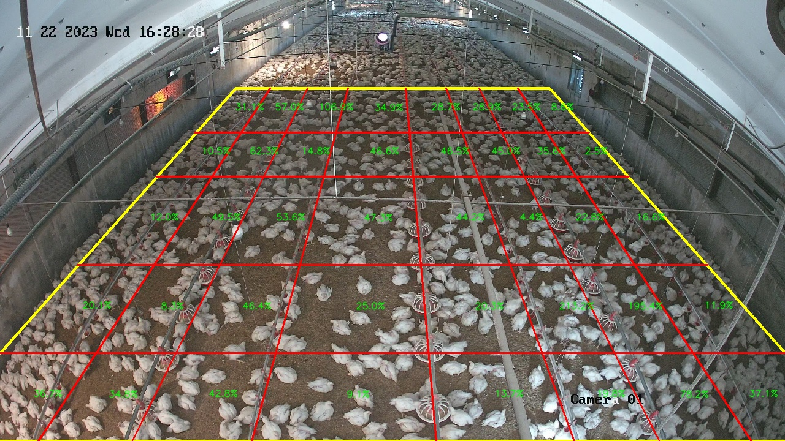

# Poultry Movement Analysis via Optical Flow
---

This project analyzes the movement of poultry in a controlled environment using **optical flow** techniques. The movements are captured through CCTV cameras, and a scene is divided into grid regions for detailed analysis. The goal is to quantify the movements of poultry and detect anomalies or significant changes compared to baseline activity levels.

## Project Overview

The project involves tracking the movement of poultry within a facility through CCTV video footage. Optical flow is used to calculate the motion across the entire scene, which is then broken down into 40 smaller regions for more granular analysis. This approach provides insight into poultry behavior by comparing movement levels in each region against a pre-calculated baseline.

### Key Features:
- **Optical Flow Calculation**: Tracks motion vectors to determine movement patterns in video frames.
- **Region-based Analysis**: The scene is divided into a 40-region grid, where each region's average optical flow is computed.
- **Baseline Calculation**: A baseline is calculated from reference videos, representing the normal movement levels in each region.
- **Movement Detection**: In test videos, the movement in each region is compared against the baseline to identify unusual activity.

### Example Output

Below is a sample frame from the final output, showing the grid overlay and calculated movement percentages in each region.

## Project Structure
- **Code**: All code for calculating optical flow, processing videos, and generating outputs is included.
- **Data**: Sample videos used for baseline calculation and testing.
- **Results**: Output videos and movement data for test scenarios.

## Future Improvements
- **Real-time Analysis**: Implementation of real-time movement tracking directly from video feed.
- **Anomaly Detection**: Automatically flag significant changes in movement patterns.
- **Behavioral Analysis**: Correlate movement data with environmental factors or health conditions of poultry.

## License
This project is licensed under the MIT License. See the [LICENSE](LICENSE) file for details.

---

Feel free to modify the structure or add any other sections relevant to your project! You can link the provided image properly by updating the correct path when uploading to the repository.
